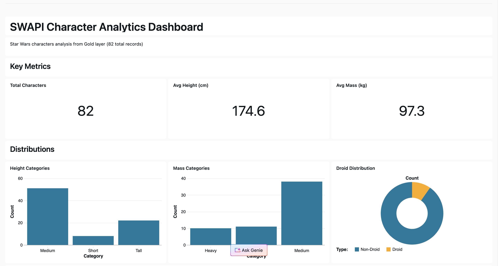
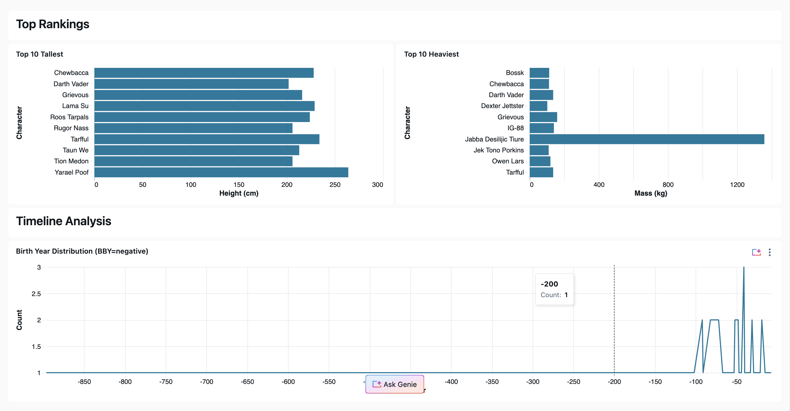

# SWAPI Data Pipeline

A Databricks data pipeline that ingests and transforms Star Wars character data from the SWAPI (Star Wars API) into a medallion architecture (Bronze → Silver → Gold).

## Overview

This project demonstrates a complete ETL pipeline on Databricks using Delta Lake with a 3-tier medallion architecture:

- **Bronze (Raw)**: Ingests 82 Star Wars characters from SWAPI
- **Silver (Cleaned)**: Cleanses and standardizes character data with derived attributes
- **Gold (Dimensional)**: Creates a dimensional model optimized for analytics

## Architecture

```
SWAPI API
    ↓
Bronze Layer (swapi_demo.raw_data.characters)
    ↓
Silver Layer (swapi_demo.silver.characters_cleaned)
    ↓
Gold Layer (swapi_demo.gold.dim_characters)
    ↓
AI/BI Dashboard (KPI Analytics & Visualizations)
```

## Files

- **`ingest_swapi.py`** - Ingests character data from SWAPI API
- **`transform_silver.py`** - Cleanses and transforms bronze data to silver layer
- **`transform_gold.py`** - Creates dimensional model from silver data

## Data Flow

### Ingestion (Bronze)
- Fetches data from `https://swapi.dev/api/people/`
- Stores raw JSON records in `swapi_demo.raw_data.characters`
- 82 total Star Wars characters

### Silver Transformation
- Cleans null/missing values
- Parses derived columns (height categories, mass categories, droid classification)
- Creates standardized column names
- Generated table: `swapi_demo.silver.characters_cleaned`

### Gold Transformation
- Creates dimensional table with 10 columns including identity PK
- Categorizes characters by height and mass
- Adds droid/non-droid classification
- Generated table: `swapi_demo.gold.dim_characters` (82 rows, optimized for analytics)

## Key Outputs

- **Total Characters**: 82
- **Height Categories**: Short (~160cm), Medium (160-200cm), Tall (>200cm)
- **Mass Categories**: Light (<50kg), Medium (50-100kg), Heavy (>100kg)
- **Droids**: 8 droids, 74 non-droids
- **Birth Year Range**: -896 BBY to 256 ABY

## AI/BI Dashboard

View the prepared KPI AI/BI dashboard: `swapi_kpi_dashboard.lvdash.json`

### AI/BI Dashboard KPIs
- 3 Key metrics counters (Total, Avg Height, Avg Mass)
- 3 Distribution charts (Height/Mass categories, Droid split)
- Rankings (Top 10 tallest and heaviest)
- Timeline analysis (Birth year distribution)

### AI/BI Dashboard Screenshots

**AI/BI Dashboard Overview:**


**AI/BI Dashboard Details:**


## Technology Stack

- **Databricks** - Data lakehouse platform
- **Delta Lake** - ACID transactional storage
- **PySpark** - Distributed data processing
- **Python** - Data engineering scripts

## Requirements

- Databricks workspace access
- SQL warehouse or cluster for execution
- Unity Catalog enabled (swapi_demo catalog)

## Running the Pipeline

Each script is deployed as a Databricks on-demand job:

1. **Ingest Job** - Loads SWAPI data (runs first)
2. **Silver Transform Job** - Cleanses bronze data (runs after ingest)
3. **Gold Transform Job** - Creates dimensional model (runs after silver)

## Data Schema (Gold Layer)

```
character_id       INT         (IDENTITY PK)
character_name     STRING      Character name
height_cm          DECIMAL     Height in centimeters
height_category    STRING      Short / Medium / Tall
mass_kg            DECIMAL     Mass in kilograms
mass_category      STRING      Light / Medium / Heavy
is_droid           BOOLEAN     True if droid
birth_year_timeline STRING     Birth year (BBY/ABY format)
planet_name        STRING      Home planet
film_count         INT         Number of film appearances
```

## License

MIT
